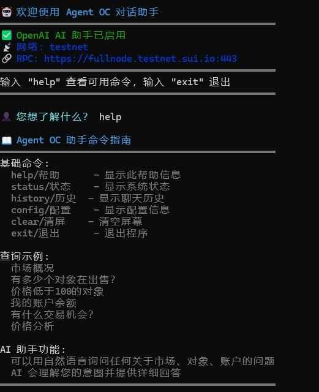

# Agent OC 对话助手使用指南

Agent OC 现在支持交互式对话界面，可以通过自然语言查询市场信息、对象详情、账户余额等。支持OpenAI API和OpenAI兼容的大模型。

## 🚀 快速开始

### 1. 环境配置

首先复制环境变量文件并配置：

```bash
cp .env.example .env
```

编辑 `.env` 文件，配置以下关键变量：

```env
# 启用对话界面
ENABLE_CHAT_INTERFACE=true

# OpenAI 配置（支持OpenAI兼容的大模型）
OPENAI_API_KEY=0b8ecbb468a74065900aaee933562b30.5HsYvbhdEVOPXzI6
OPENAI_MODEL=GLM-4.5-Flash
OPENAI_MAX_TOKENS=1000
OPENAI_TEMPERATURE=0.7
OPENAI_BASE_URL=https://open.bigmodel.cn/api/paas/v4

# Sui 网络配置
SUI_NETWORK=mainnet
SUI_RPC_URL=https://fullnode.mainnet.sui.io:443

# 代理私钥（用于账户相关查询）
AGENT_PRIVATE_KEY=your_private_key_here

# 合约配置
CONTRACT_PACKAGE_ID=your_package_id
MARKETPLACE_OBJECT_ID=your_marketplace_id
```

### 2. 安装依赖

```bash
npm install
```

### 3. 启动对话模式

```bash
npm run chat
```

或者直接运行：

```bash
npx ts-node src/chat.ts
```

## 📖 功能特性

### 🤖 AI 助手功能（支持OpenAI和兼容模型）

当配置了 `OPENAI_API_KEY` 后，您可以：

- **自然语言查询**：用日常语言询问任何关于市场、对象、账户的问题
- **智能意图识别**：AI 会理解您的查询意图并提供相应回答
- **上下文记忆**：AI 会记住对话历史，提供连贯的交流体验
- **多模型支持**：支持OpenAI GPT系列和OpenAI兼容的大模型（如GLM、通义千问等）
- **多语言支持**：支持中文查询和回答

### 🔍 基础查询功能（无需AI）

即使没有配置 API，您仍然可以使用基础查询：

- **市场信息查询**：获取市场统计数据、价格分布等
- **对象筛选查询**：按价格、表情、状态等条件筛选对象
- **账户信息查询**：查询余额、持仓、在售对象等
- **交易信息查询**：获取交易机会、自动交易状态等
- **价格分析查询**：获取价格统计、趋势分析等

## 🌐 支持的AI模型

### OpenAI 官方模型
- GPT-3.5-turbo
- GPT-4
- GPT-4-turbo
- GPT-4o
- GPT-4o-mini

### OpenAI 兼容的大模型
- **GLM系列**：GLM-4、GLM-4-Flash、GLM-4V
- **通义千问**：ChatGLM、ChatGLM2、ChatGLM3
- **智谱AI**：GLM-4、Embedding-2
- **百川**：Baichuan2、Baichuan2-Turbo
- **月之暗面**：Kimi、Kimi-2
- **零一万物**：Yi-34B、Yi-34B-Chat
- **深度求索**：DeepSeek-Chat、DeepSeek-Coder
- **其他兼容模型**：任何支持OpenAI API格式的模型

## 💬 使用示例

### AI 助手查询示例

```
👤 市场上有多少个对象在出售？
👤 价格低于100 USDC的对象有哪些？
👤 我的账户余额是多少？
👤 有什么好的交易机会？
👤 分析一下当前的市场价格趋势
👤 帮我看看表情为🤖的对象
👤 用GLM模型帮我分析一下市场
👤 使用通义千问模型查询我的持仓
```

### 基础查询命令示例

```
市场概况
有多少个对象在出售？
价格低于100的对象
表情为🤖的对象
在售的对象
我的账户余额
我的持仓
交易机会
自动交易状态
价格分析
价格趋势
价格分布情况
市场估值如何？
```

## 🎯 内置命令

在对话界面中，您可以使用以下特殊命令：

- `help` / `帮助` - 显示此帮助信息
- `status` / `状态` - 显示系统状态
- `history` / `历史` - 显示聊天历史（仅 AI 模式）
- `config` / `配置` - 显示配置信息
- `clear` / `清屏` - 清空屏幕
- `exit` / `退出` - 退出程序

## 🔧 配置选项

### 环境变量配置

| 变量名 | 必需 | 默认值 | 说明 |
|--------|------|--------|------|
| `ENABLE_CHAT_INTERFACE` | 是 | true | 是否启用对话界面 |
| `OPENAI_API_KEY` | 否 | - | OpenAI API 密钥或兼容模型API密钥 |
| `OPENAI_MODEL` | 否 | gpt-3.5-turbo | AI 模型名称 |
| `OPENAI_MAX_TOKENS` | 否 | 1000 | 最大令牌数 |
| `OPENAI_TEMPERATURE` | 否 | 0.7 | 温度参数 |
| `OPENAI_BASE_URL` | 否 | https://api.openai.com/v1 | API 基础URL |
| `CHAT_HISTORY_LIMIT` | 否 | 50 | 聊天历史限制 |
| `QUERY_TIMEOUT` | 否 | 30000 | 查询超时时间（毫秒）|

### 支持的模型配置

#### OpenAI 官方模型
```env
OPENAI_MODEL=gpt-3.5-turbo
OPENAI_BASE_URL=https://api.openai.com/v1
```

#### GLM 模型系列
```env
OPENAI_MODEL=GLM-4-Flash
OPENAI_BASE_URL=https://open.bigmodel.cn/api/paas/v4
```

#### 通义千问模型
```env
OPENAI_MODEL=ChatGLM3
OPENAI_BASE_URL=https://open.bigmodel.cn/api/paas/v4
```

#### 其他兼容模型
```env
OPENAI_MODEL=your-model-name
OPENAI_BASE_URL=https://your-provider.com/api/v1
```

### 运行时配置

您也可以在运行时通过代码修改配置：

```typescript
import { ChatInterface } from './src/services/chatInterface';

const chatInterface = new ChatInterface();

// 更新配置
chatInterface.updateConfig({
  showTimestamps: false,
  maxHistoryDisplay: 20
});

// 设置用户地址
chatInterface.setUserAddress('0x...');
```

## 📊 查询类型详解

### 1. 市场信息查询

**支持的关键词**：市场、market、统计、数据、概况

**返回信息**：
- 总对象数量
- 在售对象数量
- 平均价格
- 总交易量
- 价格分布
- 最近活动统计

**示例查询**：
- "市场概况"
- "市场统计"
- "总交易量是多少？"
- "有多少个对象在出售？"

### 2. 对象信息查询

**支持的关键词**：对象、object、商品、物品

**筛选条件**：
- 价格筛选：`价格低于100`、`大于500`
- 表情筛选：`表情为🤖`
- 状态筛选：`在售对象`、`已售对象`

**示例查询**：
- "显示所有对象"
- "价格低于100的对象"
- "表情为🤖的对象"
- "在售的对象"

### 3. 账户信息查询

**支持的关键词**：账户、余额、balance、持仓

**返回信息**：
- 钱包地址
- 拥有对象数量
- 在售对象数量
- 持有对象总价值
- 在售对象价值
- 自动交易持仓
- 总资产价值

**示例查询**：
- "我的账户余额"
- "我的持仓"
- "我拥有多少个对象？"
- "我的在售对象"

### 4. 交易信息查询

**支持的关键词**：交易、trading、策略、机会

**返回信息**：
- 发现的交易机会数量
- 当前持仓情况
- 自动交易配置
- 最佳交易机会列表

**示例查询**：
- "交易机会"
- "有什么好机会？"
- "我的持仓情况"
- "自动交易状态"

### 5. 价格分析查询

**支持的关键词**：价格、price、分析、趋势

**返回信息**：
- 平均价格
- 最低/最高价格
- 中位价格
- 价格分布统计
- 市场趋势分析

**示例查询**：
- "价格分析"
- "价格趋势"
- "价格分布情况"
- "市场估值如何？"

## 🛠️ 故障排除

### 常见问题

1. **API 密钥错误**
   ```
   错误: OPENAI_API_KEY not found
   ```
   **解决方案**：检查 `.env` 文件中的 `OPENAI_API_KEY` 配置

2. **模型不支持错误**
   ```
   错误: Model not supported
   ```
   **解决方案**：检查模型名称是否正确，确保使用支持的模型

3. **Base URL 错误**
   ```
   错误: Invalid Base URL
   ```
   **解决方案**：检查 `OPENAI_BASE_URL` 配置是否正确

4. **私钥格式错误**
   ```
   错误: Invalid private key format
   ```
   **解决方案**：确保私钥格式正确，以 `0x` 开头

5. **依赖安装失败**
   ```
   错误: Cannot find module 'inquirer'
   ```
   **解决方案**：运行 `npm install` 安装所有依赖

6. **聊天界面未启用**
   ```
   错误: Chat interface is disabled
   ```
   **解决方案**：在 `.env` 文件中设置 `ENABLE_CHAT_INTERFACE=true`

### 模型特定问题

#### GLM 模型
- **API限制**：注意GLM模型的API调用频率限制
- **Token限制**：GLM模型的token限制可能与OpenAI不同
- **响应格式**：确保使用正确的API端点

#### 通义千问模型
- **编码问题**：中文字符可能需要特殊处理
- **长度限制**：注意输入长度的限制
- **上下文窗口**：通义千问的上下文窗口可能较小

### 调试模式

启用调试模式获取更详细的日志：

```env
LOG_LEVEL=debug
DEBUG_MODE=true
```

### 日志文件

日志文件位于 `./logs/agent.log`，包含：
- 查询处理日志
- AI 交互日志
- 模型调用日志
- 错误信息
- 性能统计

## 🔄 模型切换

### 动态切换模型

您可以在运行时切换不同的AI模型：

```typescript
import { OpenAIService } from './src/services/openaiService';

const openaiService = new OpenAIService();

// 切换到GLM模型
openaiService.updateConfig({
  model: 'GLM-4-Flash',
  baseURL: 'https://open.bigmodel.cn/api/paas/v4'
});

// 切换到通义千问
openaiService.updateConfig({
  model: 'ChatGLM3',
  baseURL: 'https://open.bigmodel.cn/api/paas/v4'
});
```

### 模型性能对比

| 模型 | 速度 | 质量 | 成本 | 适用场景 |
|------|------|------|------|----------|
| GPT-3.5-turbo | 快 | 高 | 中 | 日常查询 |
| GPT-4 | 中 | 很高 | 高 | 复杂分析 |
| GLM-4-Flash | 很快 | 高 | 低 | 快速响应 |
| GLM-4 | 快 | 高 | 中 | 通用任务 |
| ChatGLM3 | 中 | 高 | 中 | 中文对话 |

## 📈 性能优化

### AI 查询优化

- **查询缓存**：相似查询会使用缓存结果
- **批量处理**：支持批量查询多个对象
- **超时控制**：防止长时间运行的查询
- **模型选择**：根据查询复杂度选择合适的模型

### 内存管理

- **历史限制**：自动清理过长的聊天历史
- **对象缓存**：缓存常用查询结果
- **垃圾回收**：定期清理未使用的资源

## 🔮 API 集成

### OpenAI 兼容API

```typescript
import { OpenAIService } from './src/services/openaiService';

// 使用自定义模型
const openaiService = new OpenAIService();

// GLM 模型示例
openaiService.updateConfig({
  model: 'GLM-4-Flash',
  baseURL: 'https://open.bigmodel.cn/api/paas/v4'
});

// 通义千问模型示例
openaiService.updateConfig({
  model: 'ChatGLM3',
  baseURL: 'https://open.bigmodel.cn/api/paas/v4'
});
```

### 多模型支持

```typescript
// 支持动态模型切换
const models = [
  { name: 'GPT-3.5-turbo', provider: 'openai' },
  { name: 'GLM-4-Flash', provider: 'zhipuai' },
  { name: 'ChatGLM3', provider: 'zhipuai' }
];

// 根据查询类型选择模型
const selectModel = (queryType: string) => {
  if (queryType.includes('复杂分析')) {
    return models.find(m => m.name.includes('4')) || models[0];
  }
  return models.find(m => m.name.includes('Flash')) || models[0];
};
```

## 🤝 贡献指南

欢迎贡献代码！请遵循以下步骤：

1. Fork 项目
2. 创建功能分支
3. 提交 Pull Request
4. 等待代码审查

### 开发环境设置

```bash
git clone <repository-url>
cd agentOC
npm install
npm run dev
```

### 测试

```bash
npm test
npm run chat:test
```

## 📄 更新日志

### v1.1.0
- ✅ 新增OpenAI兼容大模型支持
- ✅ 支持GLM系列模型
- ✅ 支持通义千问模型
- ✅ 动态模型切换功能
- ✅ 模型性能对比
- ✅ 自定义Base URL配置
- ✅ 多模型API集成

### v1.0.0
- ✅ 初始对话界面发布
- ✅ OpenAI AI 助手集成
- ✅ 自然语言查询支持
- ✅ 基础查询处理器
- ✅ 交互式命令行界面
- ✅ 彩色输出和进度指示器
- ✅ 查询历史记录
- ✅ 配置管理系统

## 📞 支持

如果您遇到问题或需要帮助：

1. 查看 [故障排除](#-故障排除) 部分
2. 检查 [GitHub Issues](https://github.com/your-repo/issues)
3. 加入我们的 [Discord 社区](https://discord.gg/your-server)
4. 发送邮件至 support@agent-oc.com

---

**享受使用 Agent OC 对话助手！** 🚀
